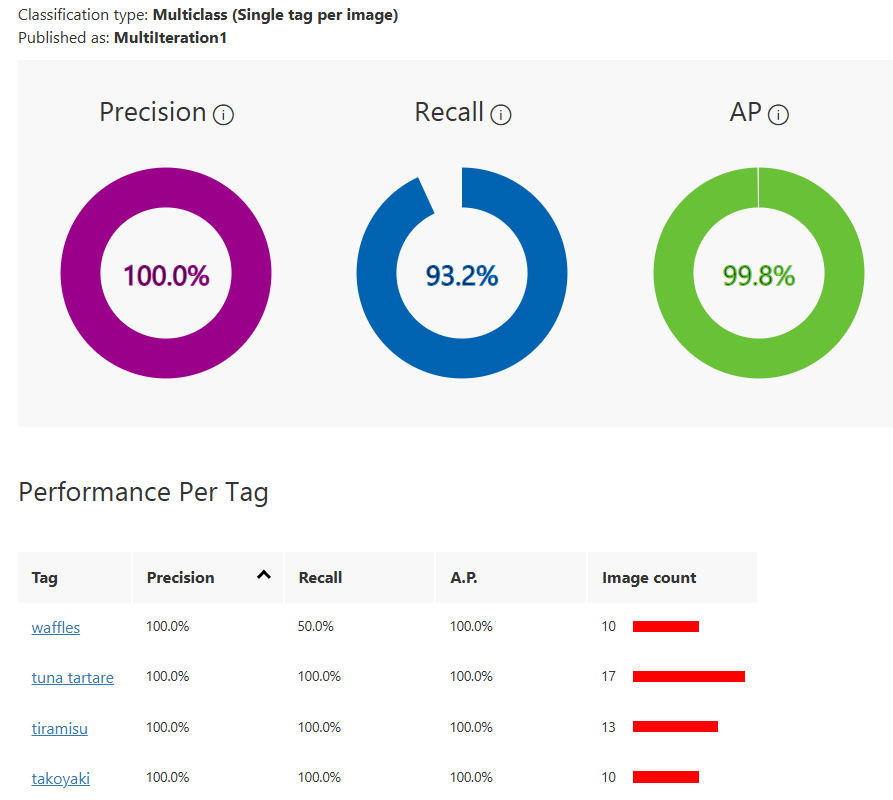
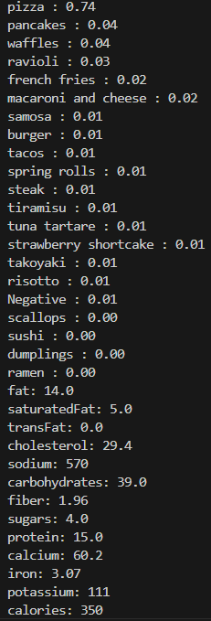

# AzureVision-FoodStatistics

An end-to-end computer vision pipeline that analyzes a food image, identifies items on the plate, and estimates nutritional information using real-world food databases (Food 101).

This project combines image classification and external nutrition APIs to transform a simple photo into actionable dietary insights.

**Features**

***Food Recognition:***  
Uses a Custom Azure Vision image classification Model under the Food Domain (custom trained with 1000+ images from the Food 101 database) to identify food items from an input image.

  

***Smart Food Mapping:***  
Maps predicted food labels to real-world entries using the USDA FoodData Central API.

***Nutrition Extraction:***  
Retrieves detailed nutritional data including:

Calories, Protein, Carbohydrates, Fat, Fiber, sugar, and micronutrients

***Serving-Based Estimation:***  
Estimates nutrition values based on standard serving sizes returned by the API.

***API Integration:***  
Seamlessly connects with external food databases for scalable, real-world applicability.

***How It Works:***  

1. Input an image of food

2. The model predicts the food category

3. The predicted label is used to query the USDA API

4. Nutritional data is retrieved and parsed

5. Key metrics are displayed in a structured format. Top 20 most likely food categories --> USDA Food Statistics of Most Likely Food

  

***Tech Stack:*** 

Python

Azure Custom Vision (Image Classification)

REST APIs (USDA FoodData Central)

OpenCV / PIL for image handling

***Why This Project?***  

Most calorie trackers rely on manual input, which is time-consuming and inaccurate. This project automates that process by combining computer vision with real nutritional datasets, making food tracking faster and more intuitive.

Mobile app integration

Personalized dietary recommendations
